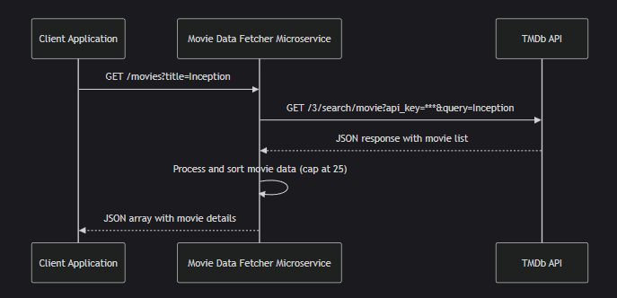

# Movie Data Fetcher Microservice

## Overview

This microservice provides basic movie details by fetching data from the TMDb API. It supports searching by movie title or movie genre and returns up to 25 results sorted in descending order by rating. Each movie object in the response includes the following fields:

- **title**
- **release_date**
- **director** (currently “N/A” since additional lookups would be needed)
- **genre** (currently “N/A” – future improvements can include mapping genre IDs to names)
- **description**
- **rating**

## Endpoint Details

**Base URL:**

For local testing, the microservice runs on:
http://localhost:8080


**Endpoint:**

GET /movies


### Query Parameters

- **title** (string):  
  Used for title-based searches.  
  **Note:** Provide only one of `title` or `genre` per request.

- **genre** (string):  
  Used for genre-based searches. In our implementation, the value should be a valid TMDb genre ID.  
  **Note:** Provide only one of `title` or `genre` per request.

## How to Programmatically Request Data

Other programs can request data by making an HTTP GET request to the `/movies` endpoint with one of the query parameters.

### Example Requests

#### Using JavaScript (Fetch API)

```javascript
// Title-based search
fetch("http://localhost:8080/movies?title=Inception")
  .then(response => {
    if (!response.ok) {
      throw new Error("Network response was not OK");
    }
    return response.json();
  })
  .then(data => console.log("Movies by Title:", data))
  .catch(error => console.error("Error:", error));

// Genre-based search (using TMDb genre ID, e.g., Action = 28)
fetch("http://localhost:8080/movies?genre=28")
  .then(response => {
    if (!response.ok) {
      throw new Error("Network response was not OK");
    }
    return response.json();
  })
  .then(data => console.log("Movies by Genre:", data))
  .catch(error => console.error("Error:", error));
```

#### Using Python (Requests Library)
```python
import requests

# Title-based search
response = requests.get("http://localhost:8080/movies", params={"title": "Inception"})
if response.status_code == 200:
    print("Movies by Title:", response.json())
else:
    print("Error:", response.json())

# Genre-based search
response = requests.get("http://localhost:8080/movies", params={"genre": "28"})
if response.status_code == 200:
    print("Movies by Genre:", response.json())
else:
    print("Error:", response.json())
```

#### How to Receive Data
**Successful Response**
- **Content-Type:** application/json
- **Structure:** A JSON array of movie objects. Each object includes:
    -  **title** (string)
    - **release_date** (string)
    - **director** (string)
    - **genre** (string)
    - **description** (string)
    - **rating** (number)

#### Example Successful Response
```json
[
  {
    "title": "Inception",
    "release_date": "2010-07-15",
    "director": "N/A",
    "genre": "N/A",
    "description": "A thief who steals corporate secrets...",
    "rating": 8.369
  },
  {
    "title": "Inception: The Cobol Job",
    "release_date": "2010-12-07",
    "director": "N/A",
    "genre": "N/A",
    "description": "This prequel unfolds courtesy of a beautiful Motion Comic...",
    "rating": 7.3
  }
  // Up to 25 movies
]
```
#### Error Responses
**If no query parameter is provided**
- **HTTP Status:** 400
- **Response Body:**
```json
{
  "error": "400 Bad Request: Invalid request. Provide either a 'title' or 'genre' query parameter."
}
```
**If no movies are found**
- **HTTP Status:** 404
- **Response Body:**
```json
{
  "error": "404 Not Found: Movie not found"
}
```

#### Detailed UML Sequence Diagram
##### Participants
- **Client Application:** Any application (or test program) making the HTTP request.
- **Movie Data Fetcher Microservice:** The Flask-based REST API.
- **TMDb API:** The external API used to fetch movie data.

##### Sequence Flow for a Title-Based Search
1. **Client → Microservice:**
    **Action:** Sends an HTTP GET request to `/movies?title=Inception`.
    **Details:** The request contains the query parameter `title=Inception`.

2. **Microservice → TMDb API:**
    **Action:** Constructs a GET request to https://api.themoviedb.org/3/search/movie with parameters including the API key and `query=Inception`.
    **Details:** The microservice sends the API key (from an environment variable) and the search query.

3. **TMDb API → Microservice:**
    **Action:** Returns a JSON payload containing a list of movies matching "Inception".
    **Details:** This JSON includes various movie details.

4. **Microservice (Processing):**
    **Action:** Processes the JSON payload (filtering, sorting by rating, and capping at 25 movies if needed).
    **Details:** It may add default values for missing fields like director and genre.

5. **Microservice → Client:**
    **Action:** Returns the processed JSON array back to the client.
    **Details:** The response contains the array of movie objects or an error message (if no movies are found).

#### Visual Respresentation

